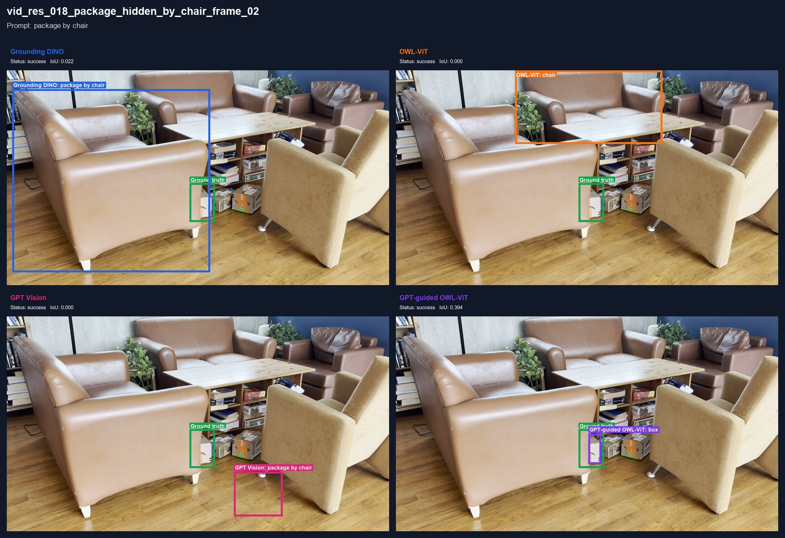
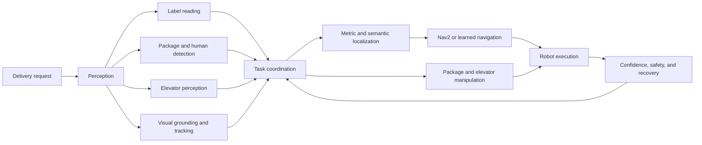
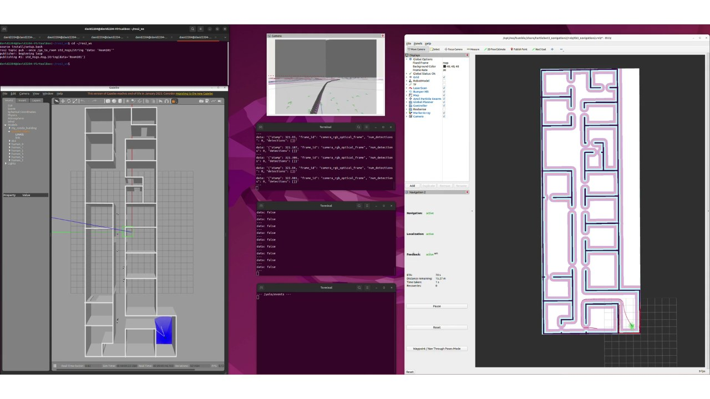
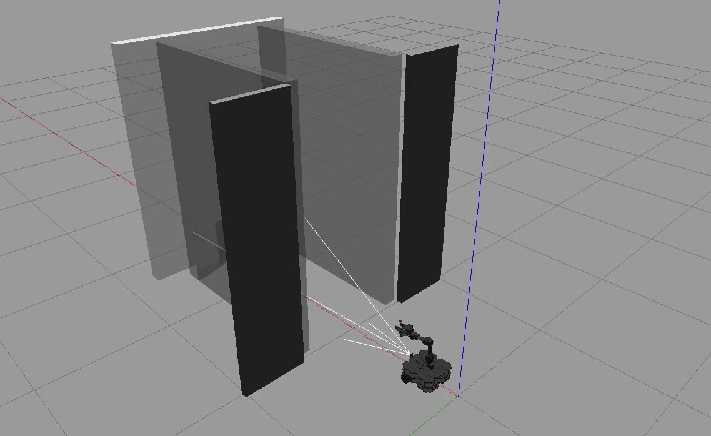
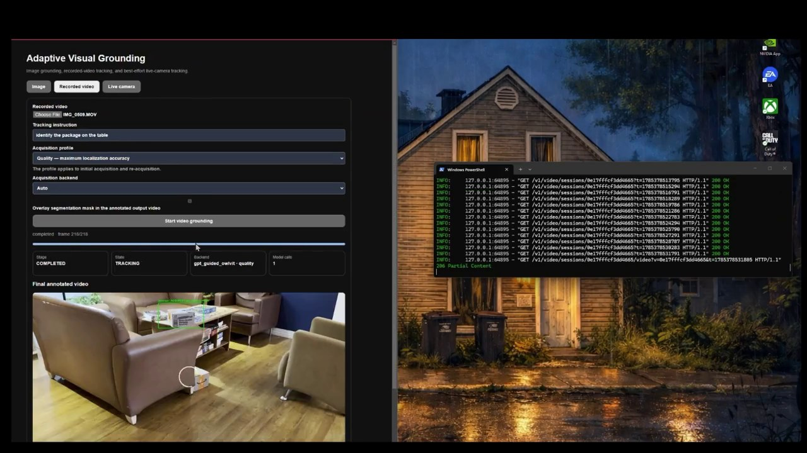
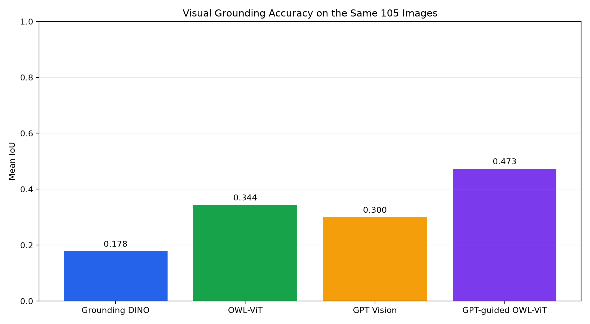
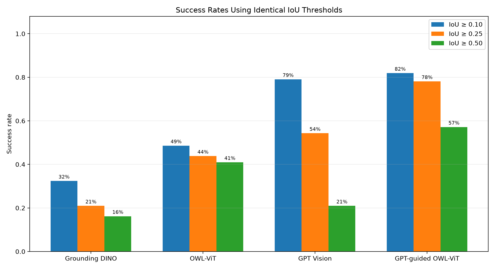

# Autonomous Multi-Floor Delivery Robot

A ROS 2 robotics project for indoor package delivery in residential buildings. The system combines package identification, metric and semantic localization, navigation, manipulation, elevator interaction, learned obstacle avoidance, and language-guided visual grounding.

> **Repository status:** In progress. Demonstrations, design documentation, evaluation results, the executed semantic-localization notebook workflow, and the complete visual-grounding module are published here. The remaining ROS 2 packages are being reorganized into one reproducible workspace before they are added.



## Project scope

The robot is intended to collect a labelled package from a designated storage area, determine its destination, navigate through a residential building, use an elevator, and complete the final hand-off while monitoring people and obstacles. The current evidence combines Gazebo simulations, recorded indoor imagery, model evaluations, and subsystem demonstrations.

The prototype assumes accessible indoor routes, functioning elevators, visible labels or targets, and packages compatible with the configured gripper.

## Capabilities

| Capability | Implemented work | Published material |
|---|---|---|
| Metric localization and navigation | Static map, AMCL, Nav2, SmacPlanner2D, DWB, and room-goal execution | [Module](modules/navigation/nav2/README.md) · [navigation demo](demos/navigation/nav2_room_to_room.mp4) · [localization demo](demos/localization/amcl_localization.mp4) |
| Package and human detection | Separate YOLOv8 detectors for awareness during robot operation | [Module](modules/perception/package_human_detection/README.md) · [demo](demos/perception/package_human_detection.mp4) |
| Package-label reading | OpenCV preprocessing and Tesseract destination extraction | [Module](modules/perception/label_recognition/README.md) · [demo](demos/perception/label_reading.mp4) |
| Package pick/place | ArUco 6-DoF pose estimation connected to MoveIt 2 grasp planning and execution | [Module](modules/manipulation/package_pick_and_place/README.md) · [demo](demos/manipulation/package_pick_and_place.mp4) |
| Elevator entry and exit | Elevator-opening detection with staging, temporal, and clearance checks | [Module](modules/elevator/README.md) · [demo](demos/elevator/elevator_entry.mp4) |
| Elevator-button interaction | Requested-button selection, image coordinates, Cartesian target calculation, and arm inverse kinematics | [Module](modules/elevator/button_interaction/README.md) · [demo](demos/elevator/button_interaction.mp4) |
| Semantic localization | Nine-class ResNet18 indoor place recognition | [Module and notebooks](modules/localization/semantic_localization/README.md) · [demo](demos/localization/semantic_localisation.mp4) |
| Learned obstacle avoidance | DQN navigation prototype with LiDAR-style observations and moving obstacles | [Module](modules/navigation/learned_dynamic_obstacle_avoidance/README.md) · [moving-obstacle demo](demos/navigation/RL_moving_obs_20_trimmed.mov) · [stationary-obstacle demo](demos/navigation/RL_stationary_obs_trimmed.mov) |
| Visual grounding and tracking | Four grounding methods, prompt parsing, video acquisition, tracking, service interface, tests, and saved benchmark results | [Module](modules/perception/visual_grounding/README.md) · [six demos](demos/README.md#visual-grounding-and-tracking) |
| System integration | Shared confidence checks, safety supervision, recovery states, and task coordination design | [Module](modules/system_integration/README.md) · integration in progress |

## System architecture



Each capability was evaluated independently before the final interfaces were standardized. [System architecture](docs/system_architecture.md) documents the current data flow and the planned integration boundary.

## Demonstrations

### Navigation and manipulation

[](demos/navigation/nav2_room_to_room.mp4)

The single-floor demonstrations cover [Nav2 navigation](demos/navigation/nav2_room_to_room.mp4), [AMCL localization](demos/localization/amcl_localization.mp4), [package and human detection](demos/perception/package_human_detection.mp4), [label reading](demos/perception/label_reading.mp4), and the complete [ArUco-guided pick/place sequence](demos/manipulation/package_pick_and_place.mp4).

### Elevator operation

[](demos/elevator/elevator_entry.mp4)

The elevator demonstrations show [guarded elevator entry](demos/elevator/elevator_entry.mp4), [requested-button selection and arm control](demos/elevator/button_interaction.mp4), and [semantic place recognition](demos/localization/semantic_localisation.mp4).

### Visual grounding and tracking

[](demos/visual_grounding/hidden_package.mp4)

Six public demonstrations cover uploaded-video and live-camera acquisition for a toy car, robot cube, packages, and doors. The complete list is in the [demo catalogue](demos/README.md#visual-grounding-and-tracking).

## Selected results

| Subsystem | Evaluation | Result |
|---|---|---:|
| Nav2 navigation | Tested room-to-room tasks in the mapped Gazebo environment | All tested tasks completed |
| Human detection | 1,149 images and 3,678 labelled objects at IoU 0.50 | F1 0.581; precision 0.654; recall 0.522 |
| Package detection | 16 images and 31 package instances at IoU 0.50 | F1 0.918; precision 0.933; recall 0.903 |
| Elevator-door detection | Simulated elevator dataset | mAP50-95 approximately 0.98 |
| Elevator-entry trigger | Tested Gazebo entry sequences | 100% trigger success; no false movement triggers |
| Semantic localization | 608-image, nine-class test split | 77.8% accuracy |

### Visual-grounding benchmark

All four methods were evaluated on the same 105 images, instructions, and corrected bounding boxes. Failed predictions count as zero IoU.

| Method | Mean IoU | Median IoU | IoU >= 0.25 | IoU >= 0.50 | Failures |
|---|---:|---:|---:|---:|---:|
| Grounding DINO | 0.178 | 0.038 | 21.0% | 16.2% | 0 |
| OWL-ViT | 0.344 | 0.082 | 43.8% | 41.0% | 0 |
| GPT Vision | 0.300 | 0.280 | 54.3% | 21.0% | 0 |
| GPT-guided OWL-ViT | **0.473** | **0.573** | **78.1%** | **57.1%** | 2 |




Metric definitions and additional evaluation notes are in [docs/results_and_metrics.md](docs/results_and_metrics.md). The committed per-image outputs are under [modules/perception/visual_grounding/results/final](modules/perception/visual_grounding/results/final/README.md).

## Repository layout

```text
assets/                     selected screenshots and benchmark figures
demos/                      public videos grouped by capability
docs/                       architecture, results, limitations, roadmap, and phase history
models/                     model-storage and provisioning notes
modules/                    capability-oriented project modules
  elevator/                 door state, entry/exit, and button interaction
  localization/             semantic localization documentation and notebooks
  manipulation/             package pose estimation and pick/place planning
  navigation/               Nav2 and learned obstacle-avoidance work
  perception/               labels, package/human detection, and visual grounding
  system_integration/       coordination, confidence, safety, and recovery design
notebooks/                  central index for capability-owned notebooks
ros2_ws/                    staging area for the unified ROS 2 workspace
```

## Run the visual-grounding module

Python 3.11 or 3.12 is recommended.

```powershell
cd modules\perception\visual_grounding
py -3.12 -m venv .venv
.\.venv\Scripts\Activate.ps1
python -m pip install --upgrade pip setuptools wheel
python -m pip install -e ".[service,yolo,owlvit,dino,gpt,video,evaluation,test]"
grounding-provision-owlvit
grounding-provision-dino
grounding-service --config configs\grounding_service.local.json
```

Open `http://127.0.0.1:8000` after the service starts. GPT-backed methods require `OPENAI_API_KEY`; Grounding DINO and OWL-ViT run locally after their model files are provisioned.

## ROS package publication status

The complete ROS packages are not included yet because the working implementations currently span several development workspaces with inconsistent package names, launch conventions, configuration paths, robot descriptions, model locations, and simulation assumptions. Publishing those folders unchanged would not provide a reliable build or launch path.

They are being reworked into one colcon workspace with consistent interfaces, portable paths, documented dependencies, shared launch files, reproducible model and map setup, subsystem smoke tests, and an integrated delivery launch sequence. The planned layout and publication criteria are documented in [ros2_ws/README.md](ros2_ws/README.md).

## Development history

The project developed through three phases. Attribution is kept here as historical context because several subsystems will be rebuilt and reconnected for the unified release.

| Phase | Contributions represented in this repository |
|---|---|
| Phase 1 | David: ROS navigation/localization and package/human detection. Eliam: package-label reading. Package pose estimation and pick/place were developed as collaborative subsystem work. |
| Phase 2 | David: semantic localization. Eliam: elevator entry/exit. Nate: elevator-button selection. |
| Phase 3 | David: visual grounding. Eliam: reinforcement-learning navigation. |

Phase summaries are retained under [docs/phases](docs/phases/) without using phase boundaries as the primary repository structure.

## License

This repository is released under the [MIT License](LICENSE).
