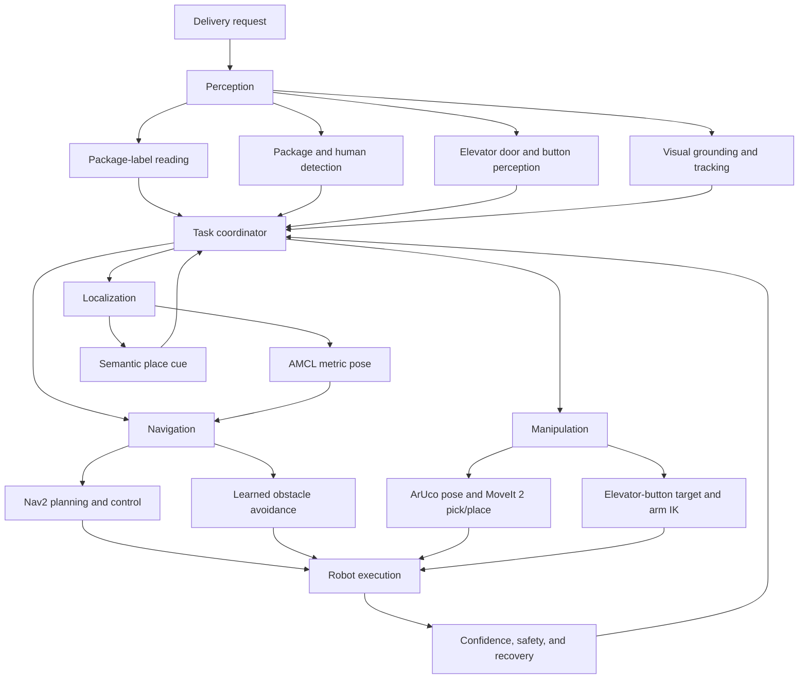

# System Architecture

The project uses independently testable capabilities connected through a task-level coordinator. Perception and localization provide structured evidence; navigation and manipulation execute verified actions; confidence, safety, and recovery checks supervise the transition between them.

## Navigation and localization

The classical navigation path uses a static occupancy grid, AMCL, Nav2, SmacPlanner2D, and DWB. Room-level commands are converted to `NavigateToPose` goals, while AMCL supplies the `map -> odom` transform. Semantic localization provides an additional building-place cue after elevator travel; it does not replace the metric pose.

The learned-navigation prototype is currently separate from the Nav2 control path. It uses 24 LiDAR-style distances and a relative goal vector in a simplified environment. A matched evaluation and ROS command interface are required before it can serve as a selectable controller.

## Package handling

The package workflow reads a destination label, estimates the package pose from an ArUco marker, builds a grasp target, and passes the target to MoveIt 2 for collision-aware planning and execution. Package and human detectors run as an awareness layer during navigation.

## Elevator workflow

```mermaid
flowchart LR
    STAGE["Elevator staging pose"] --> DOOR["Door-opening detection"]
    DOOR --> CLEAR["Temporal and clearance checks"]
    CLEAR --> ENTRY["Enter elevator"]
    ENTRY --> SELECT["Requested button"]
    SELECT --> DETECT["Button detection and selection"]
    DETECT --> TARGET["Target coordinates"]
    TARGET --> IK["Arm inverse kinematics"]
    IK --> EXIT["Floor transition and exit"]
    EXIT --> SEM["Semantic place confirmation"]
```

Door detection never commands motion by itself. Entry requires the staging pose, sufficient opening width, and consistent observations that the door is opening. Physical deployment will also require depth-based clearance and obstruction monitoring.

## Visual-grounding interface

The grounding service parses an instruction, runs a selected backend, returns a normalized bounding box, and can initialize tracking for later video frames. Its structured result includes the method, confidence, latency, target box, parser output, and status. The ROS adapter still needs to add depth, transform the selected point into the robot frame, verify reachability, and route the result through the shared supervisor.

## Integration boundary

The unified ROS workspace will standardize messages, topics, actions, transforms, launch files, parameter files, and model paths. The planned package layout is in [ros2_ws/README.md](../ros2_ws/README.md).
